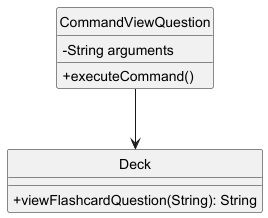
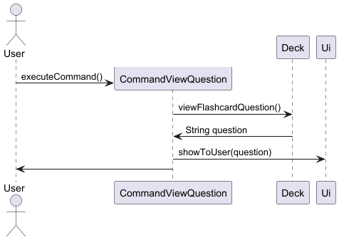
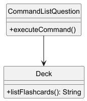
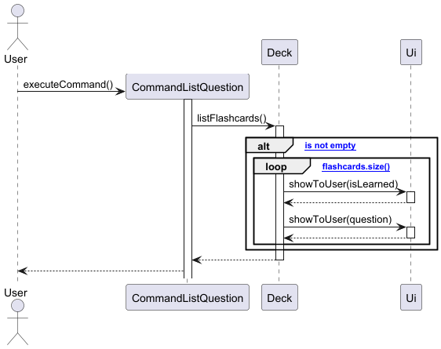
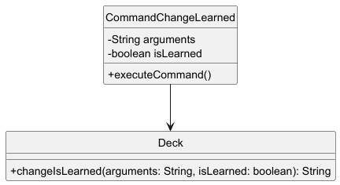
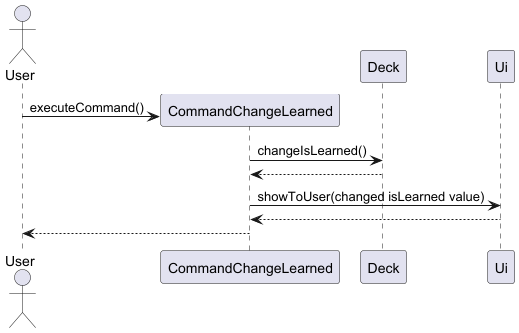
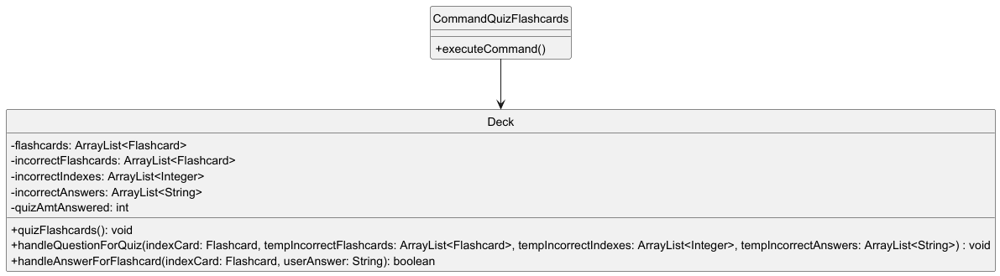
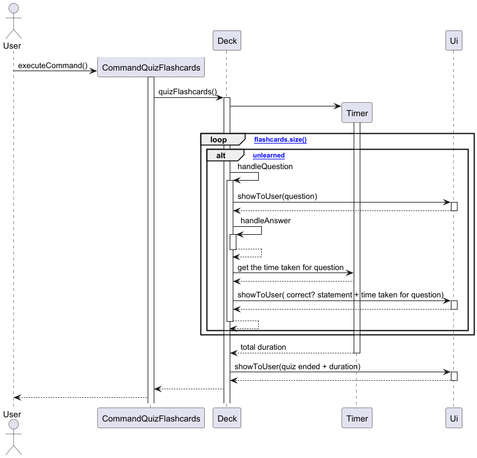
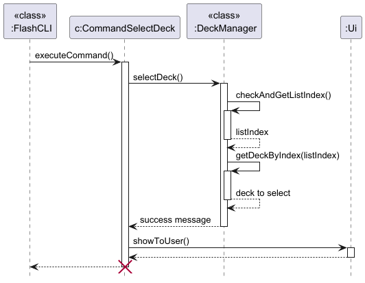
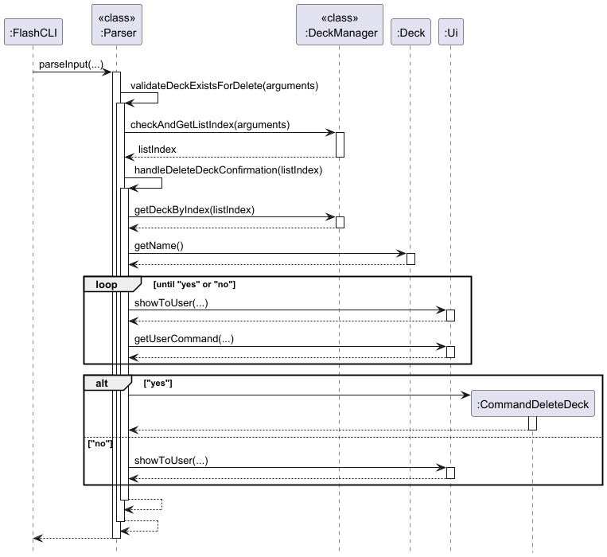

# FlashCLI Developer Guide

---

## Table of Contents
1. [Acknowledgements](#1-acknowledgements)
2. [Notes](#2-notes)
3. [Implementation](#3-implementation)
    - [3.1. Flashcard Features](#31-flashcard-features)
        - [3.1.1. Create a flashcard](#311-create-a-flashcard)
        - [3.1.2. Edit a flashcard](#312-edit-a-flashcard)
        - [3.1.3. Delete a flashcard](#313-delete-a-flashcard)
        - [3.1.4. View a flashcard question](#314-view-a-flashcard-question)
        - [3.1.5. View a flashcard question](#315-view-a-flashcard-answer)
        - [3.1.6. Insert code snippet in a flashcard](#316-insert-code-snippet-in-a-flashcard)
        - [3.1.7. List flashcards' questions](#317-list-the-flashcard-questions)
        - [3.1.8 mark learned/unlearned for a flashcard](#318-mark-learned-mark-unlearned-for-a-flashcard)
        - [3.1.9 quiz mode](#319-quiz-mode)
    - [3.2. Deck Features](#32-deck-features)
        - [3.2.1. Creating a new deck](#321-creating-a-new-deck)
        - [3.2.2. Renaming decks](#322-renaming-decks)
        - [3.2.3. Listing all decks](#323-listing-all-decks)
        - [3.2.4. Selecting a deck](#324-selecting-a-deck)
        - [3.2.5. Deleting a deck](#325-deleting-a-deck)
        - - [3.2.6. Unselecting a deck](#326-unselecting-a-deck)
        - [3.2.7. Searching](#327-searching)
        - [3.2.8. Save/Load Functionality](#328-saveload-functionality)
        - [3.2.9. Viewing quiz results ](#329-viewing-quiz-results)
4. [Appendix A: Product Scope](#appendix-a-product-scope)
5. [Appendix B: User Stories](#appendix-b-user-stories)
6. [Appendix C: Non-Functional Requirements](#appendix-c-non-functional-requirements)
7. [Appendix D: Glossary](#appendix-d-glossary)
8. [Appendix E: Instructions for manual testing](#appendix-e-instructions-for-manual-testing)

---

## 1. Acknowledgements

Third-party libraries used:
- Java SE 17 - Core Java platform
- JUnit 5 - Unit testing framework
- PlantUML - For generating UML diagrams

This project's structure was inspired by the SE-EDU AddressBook-Level3 and AddressBook-Level4 project.

---

## 2. Notes

This Developer Guide documents the core architecture and key components of FlashCLI, but does not exhaustively cover all implemented classes

---

## 3. Implementation
This section describes some noteworthy details on how the features are implemented. 

### 3.1. Flashcard features
### 3.1.1. Create a flashcard

This command allows the user to create a new flashcard with compulsory `QUESTION` and `ANSWER` fields, denoted by `/q` and `/a` tags.

The create flashcard mechanism is facilitated by `Deck` and `CommandCreateFlashcard`.

The feature requires a deck to be selected before usage.

Duplicates of the same flashcard are allowed.

#### **Before creating the flashcard, these conditions must be satisfied:**

* **Contains all arguments**: Arguments should have both tags `/q` and `/a`.
* **Correct order**: The `/q` tag comes before the `/a` tag.
* **No text before `/q` tag**: There must be no text before the `/q` tag, i.e. `hello/q QUESTION /a ANSWER` is not permitted.
* **No empty fields**: Neither `QUESTION` nor `ANSWER` field can be empty. This includes having only whitespaces in the fields.

In addition, any text after the first `/q` or `/a` tag will be considered as `QUESTION` or `ANSWER` respectively.

In particular, if there are multiple `/q` or `/a` tags, they will be considered part of the `QUESTION` or `ANSWER`.

e.g. `/q What is the weather today? /q extra question /a Sunny /a extra answer`<br>
**Question**: `What is the weather today? /q extra question`<br>
**Answer**: `Sunny /a extra answer`

Note that the question and answer fields will be trimmed.

If the arguments are invalid, the exception `FlashCLIArgumentException` will be thrown with a custom message which is shown to the user.

**Below is the sequence diagram describing the operations for creating the flashcard:**


1. When the command is executed using `CommandCreateFlashcard#executeCommand()`, the `Deck#createFlashcard()` method is called.
2. Then, `Deck#checkQuestionAndAnswer()` checks if the arguments are valid, according to the previously mentioned [conditions](#before-creating-the-flashcard-these-conditions-must-be-satisfied).
3. If it is valid, the question and answer strings will be passed to create a new `Flashcard` object.
4. A success message will then be shown to the user upon completion.

**Note**: The lifeline for `CommandCreateFlashcard` should end at the destroy marker (X) but due to a limitation of PlantUML, the lifeline continues till the end of diagram.

#### Why is it implemented this way?

- The user has to select a deck before creating a flashcard, which prevents flashcards from being created and not being in any decks.
- Each command eg `CommandCreateFlashcard` is a separate class, allowing the code to achieve the **Separation of Concerns** design principle.
- The tags `/q` and `/a` are compulsory to prevent improper creation of Flashcard objects.
- Any text after the first `/q` or `/a` tag will be considered as `QUESTION` or `ANSWER` respectively, to simplify the usage of the command and allow for a greater range of characters in the question.
- Allowing duplicates gives users the flexibility to structure their decks according to their study preferences. For example, repeating a flashcard can help reinforce a key concept by increasing exposure during review.

#### Alternatives Considered:

- Using a regex expression
  - Pros: More concise code, can handle a wider range of possible inputs with increased flexibility.
  - Cons: Difficult to debug and understand, especially for Developers with little experience with regex.
- Only allowing `/q` and `/a` tags i.e. should have no foreign tags allowed
  - Pros: Ensures that user keys in only the inputs required.
  - Cons: Difficult to define what is a "foreign" tag. Users might not be able to use `/` in their `QUESTION` or `ANSWER`. Also significantly increases complexity without achieving much functionality.

### 3.1.2. Edit a flashcard

#### Design

This feature enables the user to edit the question and answer to a specific flashcard by supplying its index and updated question and answer. It assumes the user has already selected a deck.

#### Sequence Diagram


#### Implementation

##### `Deck#editFlashcard(int index, String arguments)`

- Replaces the existing flashcard at index with updated question and answer
- Returns a confirmation of the updated flashcard that was edited

##### `CommandEdit#executeCommand()`

- Parses the index
- Validates that it's a valid number and within bounds
- Replaces and updates the existing flashcard and displays the updated flashcard

**Edge Cases Handled:**
- Invalid index format → `NumberFormatException`
- Out-of-bounds index → `ArrayIndexOutOfBoundsException`

### 3.1.3. Delete a flashcard

#### Design

The delete flashcard feature allows users to remove a specific flashcard from the currently selected deck based on index. The system validates the index and ensures it’s within bounds.

#### Class Diagram


#### Sequence Diagram


#### Implementation

##### `Deck#deleteFlashcard(int index)`

- Removes the flashcard at the given index
- Returns a confirmation message with the deleted flashcard's content

##### `CommandDelete#executeCommand()`

- Parses the index from user input
- Validates it as a number and within bounds
- Invokes `deleteFlashcard(...)`
- Displays confirmation or appropriate error messages

**Edge Cases Handled:**
- Invalid input format (e.g., not an integer) → `NumberFormatException`
- Index out of bounds → `ArrayIndexOutOfBoundsException`

### 3.1.4. View a flashcard question

#### Design 

This feature enables the user to view the question to a specific flashcard by supplying its index. It assumes the user has already selected a deck.

#### Class Diagram



#### Sequence Diagram



#### Implementation

`viewFlashcardQuestion`
- Fetches the question from the target flashcard with its index, as well as its isLearned value.
- Returns the question as a String.

**Edge cases handled:**
- If index for flashcard to be viewed is not a number → throws `NumberFormatException`
- If index for flashcard is outside of deck size. (lower or equals to 0, and more than the size of the deck) → throws `FlashCliArgumentException`
- If no index is inputted → throws `FlashCLIArgumentException`


### 3.1.5. View a flashcard answer

#### Design

This feature enables the user to view the answer to a specific flashcard by supplying its index. It assumes the user has already selected a deck.

#### Class Diagram


#### Sequence Diagram


#### Implementation

##### `Deck#viewFlashcardAnswer(int index)`

- Returns the answer text of the flashcard at the given index

##### `CommandViewAnswer#executeCommand()`

- Parses the index
- Validates that it's a valid number and within bounds
- Retrieves and displays the answer

### 3.1.6. Insert code snippet in a flashcard

#### Design

This feature enables the user to insert a code snippet to a specific flashcard by supplying its index and code snippet. It assumes the user has already selected a deck.

#### Sequence Diagram


#### Implementation

##### `Deck#insertCodeSnippet(int index, String arguments)`

- Formats and adds a code snippet into an existing flashcard
- Returns a confirmation of the updated flashcard with the code snippet

##### `CommandInsertCode#executeCommand()`

- Parses the index
- Validates that it's a valid number and within bounds
- Inserts the provided code snippet into the existing flashcard and displays the updated flashcard with code snippet

**Edge Cases Handled:**
- Invalid index format → `NumberFormatException`
- Out-of-bounds index → `ArrayIndexOutOfBoundsException`

### 3.1.7 List the flashcard questions

Allows the user to list out all the flashcard questions in the current deck. It assumes that the user is currently in a deck.

#### Design

Iterates through the deck, and prints out the question for each flashcard.

#### Class Diagram



#### Sequence Diagram


#### Implementation
`listFlashcards`
- appends to a string with the index of the question, the isLearned value of the flashcard(as "[ ]" if unlearned and "[X]" if learned) and the flashcard's question, for each flashcard. A "\n" is further written to separate the flashcards.
- returns aforementioned string

**Edge cases handled:**
- If the deck is empty → throws `EmptyListException`

**Improvements made**
- Added isLearned value into the list, to help users find out the isLearned status of all their flashcards at a glance. 

### 3.1.8 Mark learned/ Mark unlearned for a flashcard

#### Design

Allows the user to mark the flashcard as learned or unlearned, by supplying the index of the flashcard they wish to change. It assumes that the user has already selected a deck.

#### Class Diagram



#### Sequence Diagram



#### Implementation

`changeIsLearned`
- changes the isLearned value of target flashcard.
- returns a string of whether it is now learned or unlearned.

**Edge Cases Handled:**
- If index for flashcard to be changed is not a number → throws `NumberFormatException`
- If index for flashcard is outside of deck size. (lower or equals to 0, and more than the size of the deck) → throws `FlashCliArgumentException`
- If no index is inputted → throws `FlashCLIArgumentException`
- If flashcard is already in the state that the user wants to mark it to, ie: the user wants to mark "learned" to an already learned flashcard → throws `FlashCLIArgumentException`

### 3.1.9 Quiz mode

#### Design

This feature allows the user to enter a timed quiz mode, by asking only the unlearned flashcards. It assumes that the user has already selected a desk.

In timed quiz mode, the flashcard's question would appear and wait for the user's input answer. If the answer is correct, the user is shown "Correct!", and if it is answered incorrectly, the user is shown "Incorrect.". Afterwards, the user would proceed to the next question.
At the start of the quiz mode, a timer object is instantiated, and its duration would be retrieved after quiz mode ends.
If the question is answered correctly, the flashcard would be mark as learned, otherwise, its isLearned value remains the same.
After the quiz is finished, the user would be shown how long he took, and an option to view results (`view_res`).

#### Sequence Diagram



#### Sequence Diagram



#### Implementation

`quizFlashcards()`
- Quizzes through the unlearned flashcards in a deck.
- Prints the "end quiz" statement to output

`handleQuestionForQuiz`
- Outputs the question and waits for the input to be inputted by the user.

`handleAnswerForFlashcard`
- Checks if inputted value is correct.
- Returns boolean value true if answer is correct.

**Edge Cases Handled:**
- Empty deck/no unlearned flashcards in deck. → throws `EmptyListException`
- If the quiz is cancelled midway through (through exit_quiz) → throws `QuizCancelledException`
- Empty answer inputted → the system would wait again for the user to input any answer.

#### Future updates:
- Mass quiz mode: (quiz through all unlearned flashcards)
- Endless mode: (continuously quizzing, stops when there are 3 mistakes)
- Against the clock mod: (quiz must be done by a certain timing)

### 3.2. Deck features
### 3.2.1. Creating a New Deck

This feature allows the user to create a new deck with a deck name. 

The create deck mechanism is facilitated by `DeckManager` and `CommandCreateDeck`.

To ensure deck names are unique, a `LinkedHashMap` is used to track existing deck names.

#### **Before creating the deck, these conditions must be satisfied:**
* **Duplicate Deck Name**: If the user attempts to create a deck with a name that already exists, an error message is displayed, and the command is not executed.
* **Empty Deck Name**: If the new deck name is empty or consists only of whitespaces, it is considered invalid.
* **Names containing `/` or `\`**: Names containing these characters are invalid because it will affect saving functionality

Note that the provided deck name will be trimmed.

A `FlashCLIArgumentException` will be thrown for each of these cases, with a custom message and the error is displayed to the user.

#### Implementation of `DeckManager.createDeck()`
Below shows the sequence diagram of the operations of creating a deck:


1. When the command is executed using `CommandCreateDeck#executeCommand()`, the `DeckManager.createDeck()` method is called.
2. The `DeckManager.createDeck()` method checks for the conditions listed above.
3. Then, a new `Deck` object is created and stored in the LinkHashMap, with the name as the key and the `Deck` object as the value.
4. A success message will then be shown to the user upon completion.

The diagram purposely omits interactions with `Ui` as it would unnecessarily complicate the diagram. Hence, to clarify, the error and success messages will be shown to the user for each condition. 

**Note**: The lifeline for `CommandCreateDeck` should end at the destroy marker (X) but due to a limitation of PlantUML, the lifeline continues till the end of diagram.

#### Why is it implemented this way?

- **Deck name uniqueness** is enforced to prevent user confusion and improve usability, ensuring each deck can be clearly identified.

- A **`LinkedHashMap`** is used over `HashMap` for efficient `O(1)` lookups and to preserve the insertion order of decks, which supports predictable and user-friendly display — a consideration also relevant in the [select decks feature](#324-selecting-a-deck).

- **`DeckManager` handles all deck-related logic** to follow the **Single Responsibility Principle**, improving code maintainability and separation of concerns.

### 3.2.2. Renaming decks

This feature allows users to rename selected decks.

The `rename` command is implemented using the `DeckManager` class and the `CommandRenameDeck` class. A `LinkedHashMap` is used to track existing deck names. A deck has to be selected before being able to use this command.

The ordering of the decks is preserved.

#### **Before renaming a deck, these conditions must be satisfied:**
* **Unchanged Name**: If the user renames back to the same name as previous, it will not be allowed.
* **Duplicate Deck Name**: The user will not be able to rename the selected deck to deck names that are already created.
* **Empty Deck Name / Whitespace-Only Names**: Empty deck names or names consisting solely of spaces are considered invalid.
* **Names containing `/` or `\`**: Names containing these characters are invalid because it will affect saving functionality


A `FlashCLIArgumentException` will be thrown for each of these cases, with a custom message and the error is displayed to the user.

#### Implementation of `DeckManager.renameDeck()`


1. The `DeckManger.validateNewDeckName()` method checks the new deck name according to the [conditions](#before-renaming-a-deck-these-conditions-must-be-satisfied).
2. The `Deck` object must be preserved, as it contains all the flashcards created. Hence, we rename the `Deck` using `Deck#setname()`.
3. However, as the keys of the `LinkedHashMap` are immutable, we cannot update it directly.
4. Thus, we create a new `LinkedHashMap` and copy over all previous entries while updating the new deck name.
5. This ensures that relative order is preserved during the rename process.

#### Why is it implemented this way?

- **Deck order is preserved** to maintain a consistent and intuitive user experience — renaming a deck should not change its position in the list.
- Since **`LinkedHashMap` does not support key updates directly**, we reconstruct the map when renaming a deck. This allows the renamed deck to stay in the same position.
- While this introduces a time complexity of **`O(n)`**, the tradeoff is justified by the importance of preserving deck order.
- The actual `Deck` object is preserved to retain all associated flashcards — only the name (key) is updated.

### 3.2.3. Listing all decks

This feature allows users to view all decks along with their corresponding indices. It does not allow any arguments, although whitespace is allowed.

The `decks` command is implemented using the `DeckManager` class and the `CommandViewDecks` class. 

The ordering of the decks is preserved.

#### Implementation of `DeckManager.viewDecks()`
* Using the `StringBuilder` class from `java.lang`, the method prints the name of each deck in the hashmap, along with a counter index that goes from 1 to n.

#### Handling Edge Cases
* **No Decks**: If there are no decks available, the user will not be able to list them.
* **No extra arguments**: There must be no input after the command. e.g. `decks abc` is not allowed. However, whitespace is allowed.

A `FlashCLIArgumentException` will be thrown for each of these cases, with a custom message and the error is displayed to the user.

### 3.2.4. Selecting a deck

This command allows the user to select a deck via its `INDEX`, which can be viewed using the `decks` command.

The `select` command is implemented using the `DeckManager` class and the `CommandSelectDeck` class.

#### **Before selecting a deck, these conditions must be satisfied:**
* **No Decks**: If there are no decks available, the user will not be able to select any decks.
* **Invalid index**: 
  * Checks the following conditions:
    * Empty or whitespace input provided
    * Not a number
    * Index out of bounds

A `FlashCLIArgumentException` will be thrown for each of these cases, with a custom message and the error is displayed to the user.

#### Implementation of `DeckManager.selectDeck()`

* Checks for the [conditions](#before-selecting-a-deck-these-conditions-must-be-satisfied) listed above
* `DeckManager.checkAndGetListIndex()` checks if the index is valid and returns listIndex.
* Then, we get the deck corresponding to that index. The `LinkedHashMap` has to be converted into a `Set` via the `entrySet()` method and then to a `List`. This is to facilitate the accessing of decks via index.
* After getting the deck, we select it by assigning it to `currentDeck`, which indicates the deck selected.

**Note**: The lifeline for `CommandSelectDeck` should end at the destroy marker (X) but due to a limitation of PlantUML, the lifeline continues till the end of diagram.

#### Why is it implemented this way?

- `LinkedHashMap` was chosen over `LinkedHashSet`, `HashMap`, `Set` etc. due to its ability to maintain insertion order and allow index access without having to maintain multiple lists. 
- We chose to convert the `LinkedHashMap` to a `List` everytime we require index access, instead of setting the `List` as an attribute. This is because the list is a shallow copy of the `LinkedHashMap` and will not be updated when the hashmap changes. To prevent adding further complexity to the code and having to maintain another list, we chose to sacrifice some speed in exchange for user convenience.
- Selection via index was also more efficient than typing the deck name, further catering to our intended audience of fast typists.

### 3.2.5. Deleting a deck

This feature allows users to remove a deck via its index. The deck need not be selected.

The `remove` command is implemented using the `DeckManager` class and the `CommandDeleteDeck` class.

#### Implementation of `DeckManager.deleteDeck()`

* When the command is sent, we first validate if the deck exists using `Parser.validateDeckExistsForDelete()`.
* This is done through `DeckManager.checkAndGetListIndex()`, which checks that the input is a valid index and converts it from String to Integer.
* Then, we confirm if the user indeed wants to delete the deck. This is done by continuously looping until the user enters "yes" or "no". The input is not case-sensitive. 
* After which, a new `CommandDeleteDeck` object is created if the user confirms deletion or a message is shown to the user if "no" is entered.

#### Handling Edge Cases
* **Invalid input**: The input is empty or consists of only whitespace, or is out of bounds of the deck list.
* **No Decks**: There are no decks to delete.

A `FlashCLIArgumentException` will be thrown for each of these cases, with a custom message and the error is displayed to the user.

### 3.2.6. Unselecting a deck

This feature allows users to unselect the current selected deck. It does not allow any arguments, although whitespace is allowed.

The `unselect` command is implemented using the `DeckManager` class and the `CommandUnselectDeck` class.

This command is mainly to facilitate testing of other commands such as `select`.

#### Implementation of `DeckManager.unselectDeck()`
* The implementation is fairly straightforward and involves setting `currentDeck` to `null` as `currentDeck` holds the current deck selected.
* A success message will be shown along with the deck name that is unselected.

#### Handling Edge Cases
* **No Decks**: If there are no decks available, the user will not be able to unselect them.
* **No extra arguments**: There must be no input after the command. e.g. `unselect abc` is not allowed. However, whitespace is allowed.

A `FlashCLIArgumentException` will be thrown for each of these cases, with a custom message and the error is displayed to the user.

### 3.2.7. Searching

#### Design

The flashcard application supports searching for flashcards either within the currently selected deck or globally across all decks.

The search feature is designed with the following constraints:

- Users may search by question (`/q`) and/or answer (`/a`)
- If no deck is selected, the search is performed globally across all decks
- If a deck is selected, only that deck is searched
- The system is case-insensitive and supports partial matches

##### Class Diagram

The following PlantUML diagram shows the key classes involved in the search operation:


##### Sequence Diagram

Below is a simplified sequence of how a search request is handled:


#### Implementation

##### `Deck#searchFlashcardQuestion(String arguments)`

This method parses the search arguments for `/q` and `/a` prefixes and returns flashcards that match either (or both) the question or answer. It supports edge cases such as:

- Only `/q` or only `/a` provided
- Input in any order (`/a first /qsecond` works too)
- Case insensitivity

The method throws a `FlashCLIArgumentException` if neither `/q` nor `/a` is present.

```java
String queryQuestion = ...; // parsed from arguments
String queryAnswer = ...;   // parsed from arguments
for (Flashcard f : flashcards) {
  boolean matches = ...;
  if (matches) matched.add(f);
}
return matched;
```

##### `DeckManager#globalSearch(String arguments)`

This method iterates through all decks in `DeckManager.decks`, calls `deck.searchFlashcardQuestion()`, and returns a formatted string of results including the deck name, question, and answer.

**Edge cases handled:**
- No decks exist → `EmptyListException`
- Malformed arguments → `FlashCLIArgumentException`
- No matches → returns `"No matching flashcards found in any deck."`

##### `CommandSearchFlashcard`

This command bridges user input with search logic:

- If `DeckManager.currentDeck == null`, invokes `DeckManager.globalSearch()`
- Otherwise, calls `Deck.searchFlashcardQuestion()`
- Sends output to `Ui.showToUser(...)`

#### Considerations & Limitations

- Currently does not support regex or fuzzy matching
- Could be extended to highlight matched terms or paginate long results
- Error handling is gracefully propagated to the UI layer

### 3.2.8. Save/Load Functionality

#### Design

The Save/Load functionality ensures persistence of flashcard data between sessions. When the program exits, it serializes all in-memory `Deck` objects into individual `.txt` files in the `./data/decks` directory. Upon startup, it reconstructs the decks by reading and parsing these `.txt` files.

This design allows easy access, portability, and simple debugging via text files, avoiding binary or JSON formats for simplicity.

#### Class Diagram


#### Sequence Diagram


#### Implementation

##### `Saving.saveAllDecks(Map<String, Deck>)`

- Creates `./data/decks/` directory if not present  
- Removes any `.txt` files that no longer correspond to in-memory decks  
- Iterates over each deck and writes its flashcards in:

```
Q: question text
A: answer text
```

Each flashcard is separated by a blank line for clarity.

**Edge cases handled:**
- Missing directory → automatically created
- Deleted decks → corresponding `.txt` files removed

##### `Loading.loadAllDecks()`

- Reads all `.txt` files in `./data/decks`
- Infers deck name from filename (e.g. `bio.txt` → deck name = `bio`)
- Parses `Q:` and `A:` pairs into `Flashcard` objects
- Adds each loaded `Deck` to a `LinkedHashMap`

**Edge cases handled:**
- Non-existent or empty folder → returns empty deck map
- Files with missing/partial questions/answers → skipped or handled gracefully

##### `FlashCLI.main()` Integration

```java
DeckManager.decks = Loading.loadAllDecks();
...
Saving.saveAllDecks(DeckManager.decks);
```

- Loads decks at startup  
- Saves them at exit, after user types the `exit` command  

#### Considerations

- File format is human-readable and editable
- Current implementation assumes well-formed files
- Future improvements: introduce backup/restore, encryption, or support for import/export formats like JSON/CSV

### 3.2.9. Viewing quiz results

#### Design

The quiz result system tracks and displays user performance after completing a flashcard quiz. It maintains three parallel collections during quizzes:

    incorrectFlashcards - Stores flashcards answered incorrectly

    incorrectIndexes - Tracks original positions of incorrect answers

    incorrectAnswers - Records the user's wrong responses

This design enables detailed post-quiz analysis while maintaining data consistency between the collections.
#### Class Diagram


#### Sequence Diagram


#### Key operations:

1. Validates quiz completion status 
2. Ensures collection sizes match
3. Calculates and displays:
4. Total questions answered
5. Correct/incorrect counts
6. Calls showMistakes() for detailed review

---

## Appendix A: Product scope
**Target user profile:**
- CS2113 student
- prefer desktop apps over other types
- prefers typing to mouse interactions
- is reasonably comfortable using CLI apps

**Value proposition:**

This app provides a no-frills solution to helping CS2113 students study and 
practice using terminal commands while memorising key information required for the course.

---

## Appendix B: User Stories

| Version | As a ... | I want to ...                                                    | So that I can ...                                      |
|---------|----------|------------------------------------------------------------------|--------------------------------------------------------|
| v1.0    | student  | create flashcards with CS2113 information on them                | memorise information in digestible quantities          |
| v1.0    | student  | view all my flashcards created                                   | see how many of them are created                       |
| v1.0    | student  | view the questions without answers                               | test my understanding of a specific question           |
| v1.0    | student  | delete flashcards                                                | remove outdated information                            |
| v1.0    | student  | edit my flashcards                                               | make updates to flashcards when necessary              |
| v1.0    | student  | show the answer after answering the questions                    | check my answers                                       |
| v2.0    | student  | mark each flashcard according to how well I remember the content | review concepts I get wrong often                      |
| v2.0    | student  | search for specific flashcards by keywords                       | revise certain questions I have trouble with           |
| v2.0    | student  | see what functions the flashcard app has                         | know how to use the commands effectively               |
| v2.0    | student  | test all cards in a deck                                         | revise the concepts related to the deck's topic        |
| v2.0    | student  | shuffle the deck                                                 | prevent memorizing answers based on order              |
| v2.0    | student  | view flashcards that I got wrong after testing                   | identify my mistakes and improve my understanding      |
| v2.0    | student  | add code snippets into flashcards                                | properly format code in questions to aid understanding |
| v2.0    | student  | organise flashcards into different decks                         | study them by topic                                    |
| v2.0    | student  | rename decks                                                     | make updates to the deck's topic                       |
| v2.0    | student  | view all decks                                                   | easily navigate and manage my flashcards               |
| v2.0    | student  | search for specific flashcards                                   | find the flashcard I want quickly                      |
| v2.0    | student  | access my flashcards and decks across sessions                   | continue my revision without losing progress           |
| v2.0    | student  | see a nice UI                                                    | have a comfortable viewing experience                  |

---

## Appendix C: Non-Functional Requirements
1. Should be compatible on any mainstream OS as long as it has Java 17 or above installed. 
2. The system should respond to user input within 5 seconds for most commands under typical usage.
3. Should be intuitive for most users familiar with a command line user interface .
4. End-users should be able to set up and run the flashcard quizzes within 3 steps (create deck, add flashcard, quiz).
5. The system has automated logging after the end of every session, and be able to store up to a casual amount of usage.

---

## Appendix D: Glossary

* *Mainstream OS* - Windows, Linux, Unix, macOS
* *Flashcard* - An Object with parameters *index*, *question*, *answer*, *codeSnippet*, *isLearned*
* *Deck* - An Object that holds array of Flashcards, as well as other parameters.

* *CLI* - Command Line Interface

* *EmptyListException* - thrown if there is an empty list present
* *FlashCLIArgumentException* - thrown if an invalid input is inputted
* *QuizCancelledException* - thrown if the quiz is cancelled halfway

---

## Appendix E: Instructions for manual testing

### Notes
* *Testing Purpose* - These instructions are for basic testing only
* *Expected Output* - Describes system behavior, not exact console output

### Setup
* *Java Requirement* - Ensure Java 17+ is installed
* *Download* - Get latest FlashCLI.jar
* *Run Command* - Execute `java -jar FlashCLI_2.0.jar`

---

## Appendix E: Instructions for manual testing

### Notes
* *Testing Purpose* - These instructions are for basic testing only
* *Expected Output* - Describes system behavior, not exact console output

### Setup
* *Java Requirement* - Ensure Java 17+ is installed
* *Download* - Get latest FlashCLI.jar
* *Run Command* - Execute `java -jar FlashCLI_2.0.jar`

---

### Test Cases

#### 1. Userguide Command
* *Test Case*
* *Prerequisites*: you do not select any deck
    * *Input*:
      ```
      user_guide
      ```
    * *Expected*:
      ```
      Quick Start:
      Create a deck of flashcards with "new", select it with "select", and begin 
      adding flashcards with "add"!
      List of commands......
      ```
#### 2. Create deck Command
* *Test Case 1 - Valid Input*
* *Prerequisites*: declare a different new deck
    * *Input*:
      ```
      new computer science
      ```
    * *Expected*:
      ```
      Deck "computer science" created, number of decks: 1
      ```

* *Test Case 2 - repetitive naming*
* *Prerequisites*: declare a deck with a same name as an existing deck
    * *Input*:
      ```
      new computer science
      ```
    * *Expected*:
      ```
      Deck name already exists!
      ```

#### 3. Show Decks Command
* *Test Case 1* valid input
* *Prerequisites*: there is at least one deck
    * *Input*:
      ```
      decks
      ```
    * *Expected*:
      ```
      List of decks:
      1. computer science
      ```
* *Test Case 2 - no deck available*
* *Prerequisites*: there is no deck
    * *Input*:
      ```
      decks
      ```
    * *Expected*:
      ```
      No decks available. Create a deck to start.
      ```

#### 4. Select and unselect a deck Command
* *Test Case 1*  select 
* *Prerequisites*: 
    * *Input*:
      ```
      select 1
      ```
    * *Expected*:
      ```
      Switched to deck "computer science"
      ```
* *Test Case 2 - unselect*
* *Prerequisites*: you already selected a deck
    * *Input*:
      ```
      unselect
      ```
    * *Expected*:
      ```
      Deck "computer science" unselected
      ```
      

#### 5. Add Flashcard Command
* *Test Case 1 - Missing deck*
* *Prerequisites*: you do not select any deck
    * *Input*:
      ```
      add /q What is binary number 1101's decimal Equivalent? /a 13
      ```
    * *Expected*:
      ```
      Select a deck first!
      ```


* *Test Case 2 - Reversed order*
* *Prerequisites*: the user has at least a deck and select it
    * *Input*:
      ```
      add /a What is binary number 1101's decimal Equivalent? /q 13
      ```
    * *Expected*:
      ```
      /a Answer first /q Question later
      Usage: add /q {QUESTION} /a {ANSWER}
      ```


* *Test Case 3 - Valid condition*
* *Prerequisites*: the user has at least a deck and select it
    * *Input*:
      ```
      add /q What is binary number 1101's decimal Equivalent? /a 13
      ```
    * *Expected*:
        ```
        Added a new flashcard.
        Question: What is binary number 1101's decimal Equivalent?
        Answer: 13
        You have 1 flashcard(s) in your deck.
        ```


#### 5. Show Flashcards Command
* *Test Case - Valid Input*
* *Prerequisites*: Under a deck and at least 1 flashcard exists
    * *Input*:
      ```
      list
      ```
    * *Expected*:
      ```
      List of flashcards:
      1. What is binary number 1101's decimal Equivalent?
      ```

#### 6. Learn and unlearn Command
* *Test Case 1 - Valid Input*
* *Prerequisites*: Under a deck and at least 1 flashcard exists
    * *Input*:
      ```
      mark_learned 1
      ```
    * *Expected*:
      ```
      Changed flashcard number 1 into learned

* *Test Case 2 - Valid Input*
* *Prerequisites*: Under a deck and at least 1 flashcard exists
    * *Input*:
      ```
      mark_unlearned 1
      ```
    * *Expected*:
      ```
      Changed flashcard number 1 into unlearned
      ```

#### 7. Insert code snippet Command
* *Test Case - Valid Input*
* *Prerequisites*: Under a deck and at least 1 flashcard exists
    * *Input*:
      ```
      insert_code 1 /c printf(hello world)
      ```
    * *Expected*:
      ```
      Inserted code snippet to flashcard.
      Question: hello
      Answer: world
      Code Snippet: printf(hello world)

* *Test Case - Invalid*
* *Prerequisites*: not under a deck
    * *Input*:
      ```
      insert_code 1 /c printf(hello world)
      ```
    * *Expected*:
      ```
      Select a deck first!
      ```

#### 8. rename Command
* *Test Case 1 - Valid Input*
* *Prerequisites*: Under a deck and at least 1 flashcard exists
    * *Input*:
      ```
      computer graphics
      ```
    * *Expected*:
      ```
      Renamed deck "computer science" to "computer graphics"

* *Test Case 2 - repetitive name*
* *Prerequisites*: Under a deck and at least 1 flashcard exists
    * *Input*:
      ```
      computer graphics
      ```
    * *Expected*:
      ```
      Deck name is unchanged!

* *Test Case 3 - Invalid*
* *Prerequisites*: not under a deck
    * *Input*:
      ```
      insert_code 1 /c printf(hello world)
      ```
    * *Expected*:
      ```
      Select a deck first!
      ```
      
#### 9. Edit flashcard command
* *Test Case 3 - Invalid*
* *Prerequisites*: Under a deck and at least 1 flashcard exists
    * *Input*:
      ```
      edit 1 /q what is binary number 1001's decimal Equivalent? /a 9
      ```
    * *Expected*:
      ```
      Updated flashcard.
      Edit Question: what is binary number 1001's decimal Equivalent?3
      Updated: what is binary number 1101's decimal Equaivalent?
      Edit Answer: 9
      Updated: 13

#### 10. Edit flashcard command
* *Test Case 1 - search by keyword(question)*
* *Prerequisites*:
    * *Input*:
      ```
      search /q What
      ```
    * *Expected*:
      ```
      Flashcards matched:
      Question: what is binary number 1001's decimal Equivalent? 3
      Update: 13

* *Test Case 2 - search by keyword(answer)*
* *Prerequisites*:
    * *Input*:
      ```
      search /a 1
      ```
    * *Expected*:
      ```
      Flashcards matched:
      Question: what is binary number 1001's decimal Equivalent? 3
      Update: 13

#### 11. Quiz mode
* *Test Case - total pipeline*
* *Prerequisites*:
    * *Input 1*:
      ```
      quiz
      ```
    * *Expected 1*:
      ```
      Entering quiz mode... get ready!
      Type 'exit_quiz' to cancel the quiz and leave at anytime
      Cancelling the quiz would not save your results
      You have 2 questions left:

      q1?
    * *Input 2*:
      ```
      a1
      ```
    * *Expected 2*:
      ```
      Correct!
      You have 1 question left:
      q2?
      ```
    * *Input 3*:
      ```
      a1
      ```
    * *Expected 3*:
      ```
      Incorrect.
      You finished the test! You took: 16 seconds!
      Type view_res to check your test result
      ```
    * *Input 4*:
      ```
      view_res
      ```     
  * *Expected 3*:
      ```
      You have answered 2 questions in the quiz.
      You got 1 questions correctly.
      You got 2 questions incorrectly.
      Review your mistakes:
      FlashCard 2 question: q2 correct answer: a2 Your answer: a1
      This is the end of the test report.
      ```
#### 12. Exit
* *Test Case*
* *Prerequisites*:
    * *Input*:
      ```
      exit
      ```
    * *Expected*:
      ```
      Thank you for using FlashCLI!


