# FlashCLI Developer Guide

---

## Table of Contents
1. [Acknowledgements](#1-acknowledgements)
2. [Notes](#2-notes)
3. [Implementation](#3-implementation)
    - [3.1. Flashcard Features](#31-flashcard-features)
        - [3.1.1. Create a flashcard](#311-create-a-flashcard)
        - [3.1.2. Edit a flashcard](#312-edit-a-flashcard)
        - [3.1.3. Delete a flashcard](#313-delete-a-flashcard)
        - [3.1.4. View a flashcard answer](#314-view-a-flashcard-answer)
        - [3.1.5. Insert code snippet in a flashcard](#315-insert-code-snippet-in-a-flashcard)
    - [3.2. Deck Features](#32-deck-features)
        - [3.2.1. Creating a new deck](#321-creating-a-new-deck)
        - [3.2.2. Renaming decks](#322-renaming-decks)
        - [3.2.3. Listing all decks](#323-listing-all-decks)
        - [3.2.4. Selecting a deck](#324-selecting-a-deck)
        - [3.2.5. Deleting a deck](#325-deleting-a-deck)
        - [3.2.6. Searching](#326-searching)
        - [3.2.7. Save/Load Functionality](#327-saveload-functionality)
        - [3.2.8. Viewing quiz results ](#328-viewing-quiz-results)
4. [Appendix A: Product Scope](#appendix-a-product-scope)
5. [Appendix B: User Stories](#appendix-b-user-stories)
6. [Appendix C: Non-Functional Requirements](#appendix-c-non-functional-requirements)
7. [Appendix D: Glossary](#appendix-d-glossary)
8. [Appendix E: Instructions for manual testing](#appendix-e-instructions-for-manual-testing)

---

## 1. Acknowledgements

Third-party libraries used:
- Java SE 17 - Core Java platform
- JUnit 5 - Unit testing framework
- PlantUML - For generating UML diagrams

This project's structure was inspired by the SE-EDU AddressBook-Level3 project.

---

## 2. Notes

This Developer Guide documents the core architecture and key components of FlashCLI, but does not exhaustively cover all implemented classes

---

## 3. Implementation
This section describes some noteworthy details on how the features are implemented. 

### 3.1. Flashcard features
### 3.1.1. Create a flashcard

This command allows the user to create a new flashcard with compulsory `QUESTION` and `ANSWER` fields, denoted by `/q` and `/a` tags.

The create flashcard mechanism is facilitated by `Deck` and `CommandCreateFlashcard`.

The feature requires a deck to be selected before usage.

#### **Before creating the flashcard, these conditions must be satisfied:**

* **Contains all arguments**: Arguments should have both tags `/q` and `/a`.
* **Correct order**: The `/q` tag comes before the `/a` tag.
* **No text before `/q` tag**: There must be no text before the `/q` tag, i.e. `hello/q QUESTION /a ANSWER` is not permitted.
* **No empty fields**: Neither `QUESTION` nor `ANSWER` field can be empty. This includes having only whitespaces in the fields.

In addition, any text after the first `/q` or `/a` tag will be considered as `QUESTION` or `ANSWER` respectively.

In particular, if there are multiple `/q` or `/a` tags, they will be considered part of the `QUESTION` or `ANSWER`.

e.g. `/q What is the weather today? /q extra question /a Sunny /a extra answer`<br>
**Question**: `What is the weather today? /q extra question`<br>
**Answer**: `Sunny /a extra answer`

Note that the question and answer fields will be trimmed.

If the arguments are invalid, the exception `FlashCLIArgumentException` will be thrown with a custom message which is shown to the user.

**Below is the sequence diagram describing the operations for creating the flashcard:**

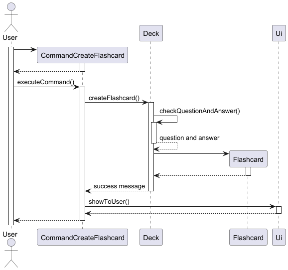

1. When the command is executed using `CommandCreateFlashcard#executeCommand()`, the `Deck#createFlashcard()` method is called.
2. Then, `Deck#checkQuestionAndAnswer()` checks if the arguments are valid, according to the previously mentioned [conditions](#before-creating-the-flashcard-these-conditions-must-be-satisfied).
3. If it is valid, the question and answer strings will be passed to create a new `Flashcard` object.
4. A success message will then be shown to the user.

**Note**: The lifeline for `CommandCreateFlashcard` should end at the destroy marker (X) but due to a limitation of PlantUML, the lifeline continues till the end of diagram.

#### Why is it implemented this way?

- The user has to select a deck before creating a flashcard, which prevents flashcards from being created and not being in any decks.
- 
- Each command eg `CommandCreateFlashcard` is a separate class, allowing the code to achieve the **Separation of Concerns** design principle.
- The tags `/q` and `/a` are compulsory to prevent improper creation of Flashcard objects.
- Any text after the first `/q` or `/a` tag will be considered as `QUESTION` or `ANSWER` respectively, to simplify the usage of the command and allow for a greater range of characters in the question.

#### Alternatives Considered:

- Using a regex expression
  - Pros: More concise code, can handle a wider range of possible inputs with increased flexibility.
  - Cons: Difficult to debug and understand, especially for Developers with little experience with regex.
- Only allowing `/q` and `/a` tags i.e. should have no foreign tags allowed
  - Pros: Ensures that user keys in only the inputs required.
  - Cons: Difficult to define what is a "foreign" tag. Users might not be able to use `/` in their `QUESTION` or `ANSWER`. Also significantly increases complexity without achieving much functionality.

### 3.1.2. Edit a flashcard

#### Design

This feature enables the user to edit the question and answer to a specific flashcard by supplying its index and updated question and answer. It assumes the user has already selected a deck.

#### Sequence Diagram

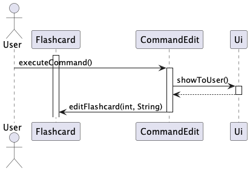

#### Implementation

##### `Deck#editFlashcard(int index, String arguments)`

- Replaces the existing flashcard at index with updated question and answer
- Returns a confirmation of the updated flashcard that was edited

##### `CommandEdit#executeCommand()`

- Parses the index
- Validates that it's a valid number and within bounds
- Replaces and updates the existing flashcard and displays the updated flashcard

**Edge Cases Handled:**
- Invalid index format → `NumberFormatException`
- Out-of-bounds index → `ArrayIndexOutOfBoundsException`

### 3.1.3. Delete a flashcard

#### Design

The delete flashcard feature allows users to remove a specific flashcard from the currently selected deck based on a 0-based index. The system validates the index and ensures it’s within bounds.

#### Class Diagram

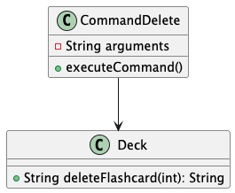

#### Sequence Diagram

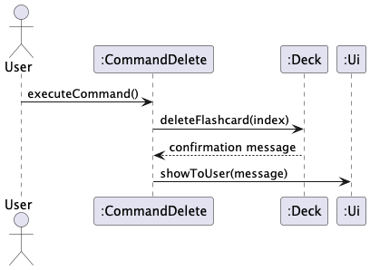

#### Implementation

##### `Deck#deleteFlashcard(int index)`

- Removes the flashcard at the given index
- Returns a confirmation message with the deleted flashcard's content

##### `CommandDelete#executeCommand()`

- Parses the index from user input
- Validates it as a number and within bounds
- Invokes `deleteFlashcard(...)`
- Displays confirmation or appropriate error messages

**Edge Cases Handled:**
- Invalid input format (e.g., not an integer) → `NumberFormatException`
- Index out of bounds → `ArrayIndexOutOfBoundsException`

### 3.1.4. View a flashcard answer

#### Design

This feature enables the user to view the answer to a specific flashcard by supplying its index. It assumes the user has already selected a deck.

#### Class Diagram

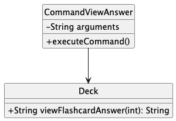

#### Sequence Diagram

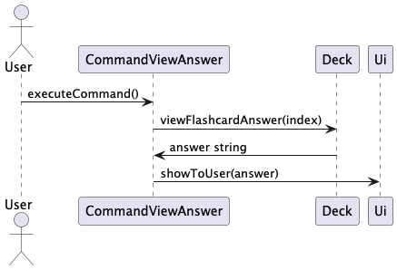

#### Implementation

##### `Deck#viewFlashcardAnswer(int index)`

- Returns the answer text of the flashcard at the given index

##### `CommandViewAnswer#executeCommand()`

- Parses the index
- Validates that it's a valid number and within bounds
- Retrieves and displays the answer

### 3.1.5. Insert code snippet in a flashcard

#### Design

This feature enables the user to insert a code snippet to a specific flashcard by supplying its index and code snippet. It assumes the user has already selected a deck.

#### Sequence Diagram


#### Implementation

##### `Deck#insertCodeSnippet(int index, String arguments)`

- Formats and adds a code snippet into an existing flashcard
- Returns a confirmation of the updated flashcard with the code snippet

##### `CommandInsertCode#executeCommand()`

- Parses the index
- Validates that it's a valid number and within bounds
- Inserts the provided code snippet into the existing flashcard and displays the updated flashcard with code snippet

**Edge Cases Handled:**
- Invalid index format → `NumberFormatException`
- Out-of-bounds index → `ArrayIndexOutOfBoundsException`

### 3.2. Deck features
### 3.2.1. Creating a New Deck

The `new` command is implemented using the `Deck` class, which represents a collection of flashcards, and the `CommandCreateDeck` class, which processes user input to create a new deck. To ensure deck names are unique, a hashmap is used to track existing deck names.

#### Implementation of `DeckManager.createDeck()`
Below shows the sequence diagram of the operations of creating a deck:
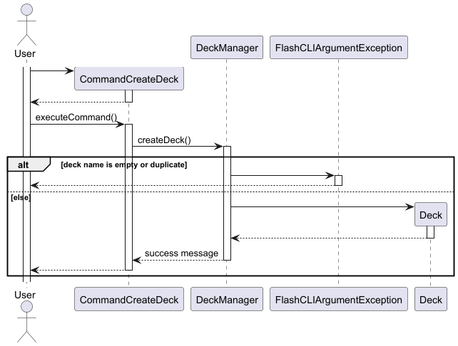

1. The user issues the command to create a new deck.
2. The `DeckManager.createDeck()` method checks whether the deck name already exists in the hashmap.
3. If the name is unique, a new `Deck` object is created and stored in the hashmap, with the name as the key and the `Deck` object as the value.
4. If the name already exists, an error message is shown to the user.

#### Handling Edge Cases
* **Duplicate Deck Name**: If the user attempts to create a deck with a name that already exists, an error message is displayed, and the command is not executed.
* **Empty Deck Name**: Empty deck names are considered invalid.
* **Whitespace-Only Names**: Deck names consisting solely of spaces are considered invalid.

A `FlashCLIArgumentException` will be thrown for each of these cases, with a custom message and the error is displayed to the user.

### 3.2.2. Renaming decks

The `rename` command is implemented using the `Deck` class and the `CommandRenameDeck` class. Similar to creating decks, a hashmap is used to track existing deck names. A deck has to be selected before being able to use this command.


#### Implementation of `DeckManager.renameDeck()`
Below shows the sequence diagram for the operations of rename deck:
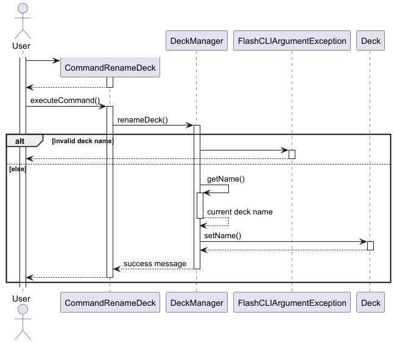

1. The user issues the command to rename an existing deck.
2. The `DeckManager.renameDeck()` method checks whether the deck name already exists in the hashmap.
3. If the new name is unique, the `name` attribute of `Deck` object will be updated to the new name. Then, the new name with the renamed `Deck` object will be added to the hashmap as a new entry. 
4. The old entry will then be removed from the hashmap.

#### Handling Edge Cases
* **Unchanged Name**: If the user renames back to the same name as previous, it will not be allowed.
* **Duplicate Deck Name**: The user will not be able to rename the selected deck to deck names that are already created.
* **Empty Deck Name / Whitespace-Only Names**: Empty deck names or names consisting solely of spaces are considered invalid.

A `FlashCLIArgumentException` will be thrown for each of these cases, with a custom message and the error is displayed to the user.

### 3.2.3. Listing all decks

The `decks` command is implemented using the `Deck` class and the `CommandViewDecks` class. 

#### Implementation of `DeckManager.viewDecks()`
* Using the `StringBuilder` class from `java.lang`, the method prints the name of each deck in the hashmap, along with a counter index that goes from 1 to n.

#### Handling Edge Cases
* **No Decks**: If there are no decks available, the user will not be able to list them.

A `FlashCLIArgumentException` will be thrown for each of these cases, with a custom message and the error is displayed to the user.

### 3.2.4. Selecting a deck

The `select` command is implemented using the `Deck` class and the `CommandSelectDeck` class.

#### Implementation of `DeckManager.selectDeck()`
* Updates `currentDeck` to the selected `Deck` object if deck exists.

#### Handling Edge Cases
* **No Decks**: If there are no decks available, the user will not be able to select any decks.
* * **Deck not found**: If the deck name is not found in the keys of the hashmap, the user will not be able to select the deck.

A `FlashCLIArgumentException` will be thrown for each of these cases, with a custom message and the error is displayed to the user.

### 3.2.5. Deleting a deck

The `remove` command is implemented using the `Deck` class and the `CommandDeleteDeck` class.

#### Implementation of `DeckManager.deleteDeck()`
* Removes the selected deck from the hashmap via its key if the deck exists.
* Also deselects the deck if the currentDeck is the deck being deleted. 
* A confirmation message is raised to the user before deletion. This can be found in `Parser`.

#### Handling Edge Cases
* **No Decks**: There are no decks to delete.
* **Deck not found**: The deck does not exists as it is not in the hashmap. 
* **Empty Deck Name / Whitespace-Only Names**: The deck name is empty or consists of only whitespace, which is not a valid deck name.

A `FlashCLIArgumentException` will be thrown for each of these cases, with a custom message and the error is displayed to the user.

### 3.2.6. Searching

#### Design

The flashcard application supports searching for flashcards either within the currently selected deck or globally across all decks.

The search feature is designed with the following constraints:

- Users may search by question (`/q`) and/or answer (`/a`)
- If no deck is selected, the search is performed globally across all decks
- If a deck is selected, only that deck is searched
- The system is case-insensitive and supports partial matches

##### Class Diagram

The following PlantUML diagram shows the key classes involved in the search operation:

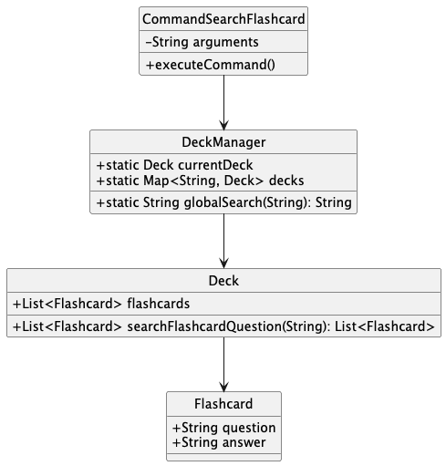

##### Sequence Diagram

Below is a simplified sequence of how a search request is handled:

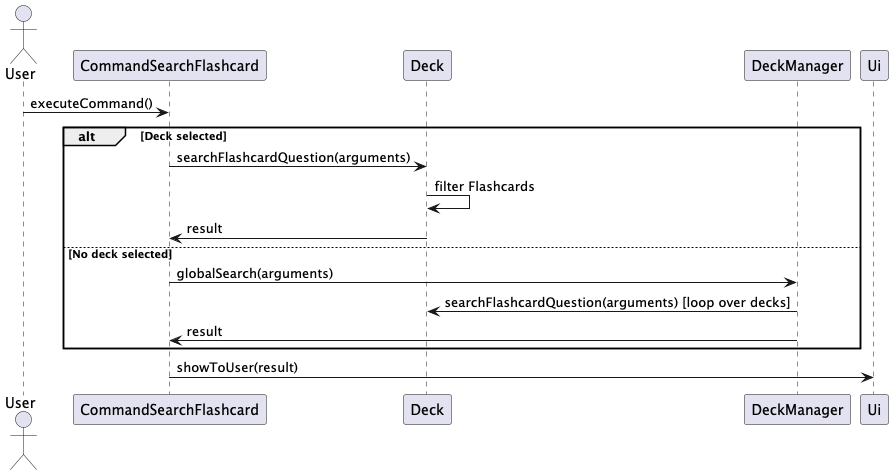

#### Implementation

##### `Deck#searchFlashcardQuestion(String arguments)`

This method parses the search arguments for `/q` and `/a` prefixes and returns flashcards that match either (or both) the question or answer. It supports edge cases such as:

- Only `/q` or only `/a` provided
- Input in any order (`/a first /qsecond` works too)
- Case insensitivity

The method throws a `FlashCLIArgumentException` if neither `/q` nor `/a` is present.

```java
String queryQuestion = ...; // parsed from arguments
String queryAnswer = ...;   // parsed from arguments
for (Flashcard f : flashcards) {
  boolean matches = ...;
  if (matches) matched.add(f);
}
return matched;
```

##### `DeckManager#globalSearch(String arguments)`

This method iterates through all decks in `DeckManager.decks`, calls `deck.searchFlashcardQuestion()`, and returns a formatted string of results including the deck name, question, and answer.

**Edge cases handled:**
- No decks exist → `EmptyListException`
- Malformed arguments → `FlashCLIArgumentException`
- No matches → returns `"No matching flashcards found in any deck."`

##### `CommandSearchFlashcard`

This command bridges user input with search logic:

- If `DeckManager.currentDeck == null`, invokes `DeckManager.globalSearch()`
- Otherwise, calls `Deck.searchFlashcardQuestion()`
- Sends output to `Ui.showToUser(...)`

#### Considerations & Limitations

- Currently does not support regex or fuzzy matching
- Could be extended to highlight matched terms or paginate long results
- Error handling is gracefully propagated to the UI layer

### 3.2.7. Save/Load Functionality

#### Design

The Save/Load functionality ensures persistence of flashcard data between sessions. When the program exits, it serializes all in-memory `Deck` objects into individual `.txt` files in the `./data/decks` directory. Upon startup, it reconstructs the decks by reading and parsing these `.txt` files.

This design allows easy access, portability, and simple debugging via text files, avoiding binary or JSON formats for simplicity.

#### Class Diagram

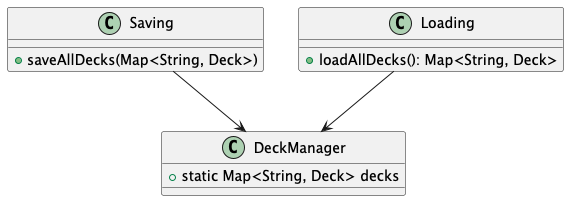

#### Sequence Diagram

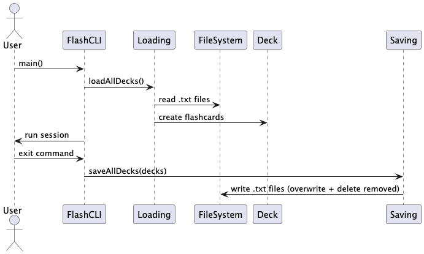

#### Implementation

##### `Saving.saveAllDecks(Map<String, Deck>)`

- Creates `./data/decks/` directory if not present  
- Removes any `.txt` files that no longer correspond to in-memory decks  
- Iterates over each deck and writes its flashcards in:

```
Q: question text
A: answer text
```

Each flashcard is separated by a blank line for clarity.

**Edge cases handled:**
- Missing directory → automatically created
- Deleted decks → corresponding `.txt` files removed

##### `Loading.loadAllDecks()`

- Reads all `.txt` files in `./data/decks`
- Infers deck name from filename (e.g. `bio.txt` → deck name = `bio`)
- Parses `Q:` and `A:` pairs into `Flashcard` objects
- Adds each loaded `Deck` to a `LinkedHashMap`

**Edge cases handled:**
- Non-existent or empty folder → returns empty deck map
- Files with missing/partial questions/answers → skipped or handled gracefully

##### `FlashCLI.main()` Integration

```java
DeckManager.decks = Loading.loadAllDecks();
...
Saving.saveAllDecks(DeckManager.decks);
```

- Loads decks at startup  
- Saves them at exit, after user types the `exit` command  

#### Considerations

- File format is human-readable and editable
- Current implementation assumes well-formed files
- Future improvements: introduce backup/restore, encryption, or support for import/export formats like JSON/CSV

### 3.2.8. Viewing quiz results

#### Design

The quiz result system tracks and displays user performance after completing a flashcard quiz. It maintains three parallel collections during quizzes:

    incorrectFlashcards - Stores flashcards answered incorrectly

    incorrectIndexes - Tracks original positions of incorrect answers

    incorrectAnswers - Records the user's wrong responses

This design enables detailed post-quiz analysis while maintaining data consistency between the collections.
#### Class Diagram

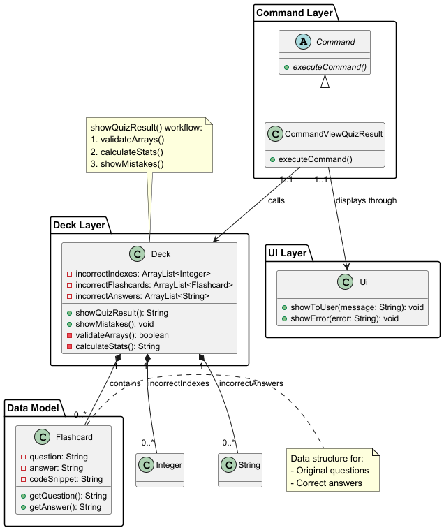

#### Sequence Diagram


#### Key operations:

1. Validates quiz completion status 
2. Ensures collection sizes match
3. Calculates and displays:
4. Total questions answered
5. Correct/incorrect counts
6. Calls showMistakes() for detailed review

---

## Appendix A: Product scope
**Target user profile:**
- CS2113 student
- prefer desktop apps over other types
- prefers typing to mouse interactions
- is reasonably comfortable using CLI apps

**Value proposition:**

This app provides a no-frills solution to helping CS2113 students study and 
practice using terminal commands while memorising key information required for the course.

---

## Appendix B: User Stories

| Version | As a ... | I want to ...                                                    | So that I can ...                                      |
|---------|----------|------------------------------------------------------------------|--------------------------------------------------------|
| v1.0    | student  | create flashcards with CS2113 information on them                | memorise information in digestible quantities          |
| v1.0    | student  | view all my flashcards created                                   | see how many of them are created                       |
| v1.0    | student  | view the questions without answers                               | test my understanding of a specific question           |
| v1.0    | student  | delete flashcards                                                | remove outdated information                            |
| v1.0    | student  | edit my flashcards                                               | make updates to flashcards when necessary              |
| v1.0    | student  | show the answer after answering the questions                    | check my answers                                       |
| v2.0    | student  | mark each flashcard according to how well I remember the content | review concepts I get wrong often                      |
| v2.0    | student  | search for specific flashcards by keywords                       | revise certain questions I have trouble with           |
| v2.0    | student  | see what functions the flashcard app has                         | know how to use the commands effectively               |
| v2.0    | student  | test all cards in a deck                                         | revise the concepts related to the deck's topic        |
| v2.0    | student  | shuffle the deck                                                 | prevent memorizing answers based on order              |
| v2.0    | student  | view flashcards that I got wrong after testing                   | identify my mistakes and improve my understanding      |
| v2.0    | student  | add code snippets into flashcards                                | properly format code in questions to aid understanding |
| v2.0    | student  | organise flashcards into different decks                         | study them by topic                                    |
| v2.0    | student  | rename decks                                                     | make updates to the deck's topic                       |
| v2.0    | student  | view all decks                                                   | easily navigate and manage my flashcards               |
| v2.0    | student  | search for specific flashcards                                   | find the flashcard I want quickly                      |
| v2.0    | student  | access my flashcards and decks across sessions                   | continue my revision without losing progress           |
| v2.0    | student  | see a nice UI                                                    | have a comfortable viewing experience                  |

---

## Appendix C: Non-Functional Requirements
1. Should be compatible on any mainstream OS as long as it has Java 17 or above installed. 
2. The system should respond to user input within 5 seconds for most commands under typical usage.
3. Should be intuitive for most users familiar with a command line user interface .
4. End-users should be able to set up and run the flashcard quizzes within 3 steps (create deck, add flashcard, quiz).
5. The system has automated logging after the end of every session, and be able to store up to a casual amount of usage.

---

## Appendix D: Glossary

* *Mainstream OS* - Windows, Linux, Unix, macOS
* *Flashcard* - An Object with parameters *index*, *question*, *answer*, *codeSnippet*, *isLearned*
* *Deck* - An Object that holds array of Flashcards, as well as other parameters.

* *CLI* - Command Line Interface

* *EmptyListException* - thrown if there is an empty list present
* *FlashCLIArgumentException* - thrown if an invalid input is inputted
* *QuizCancelledException* - thrown if the quiz is cancelled halfway

---

## Appendix E: Instructions for manual testing

### Notes
* *Testing Purpose* - These instructions are for basic testing only
* *Expected Output* - Describes system behavior, not exact console output

### Setup
* *Java Requirement* - Ensure Java 17+ is installed
* *Download* - Get latest FlashCLI.jar
* *Run Command* - Execute `java -jar FlashCLI_2.0.jar`

---

### Test Cases

#### 1. Userguide Command
* *Test Case 1 - Valid Input*
* *Prerequisites*: the user is under a deck named "computer science"
* *Input*:
  ```
  user_guide:
  ```
* *Expected*:
  Quick Start:
  Create a deck of flashcards with "new", select it with "select", and begin adding flashcards with "add"!

    List of commands

#### 2. Add Flashcard Command
* *Test Case 1 - Valid Input*
* *Prerequisites*: the user is under a deck named "computer science"
* *Input*:
  ```
  add /q What is binary number 1101's decimal Equivalent? /a 13
  ```
* *Expected*:
  Added a new flashcard.
  Question: What is binary number 1101's decimal Equivalent?
  Answer: 13
  You have 1 flashcard(s) in your deck.

* *Test Case 2 - Missing deck*
* *Prerequisites*: None
* *Input*:
  ```
  add /q What is binary number 1101's decimal Equivalent? /a 13
  ```
* *Expected*: Prompts for category input
  Select a deck first!

* *Test Case 3 - Reversed order*
* *Prerequisites*: the user is under a deck named "computer science"
* *Input*:
  ```
  add /a What is binary number 1101's decimal Equivalent? /q 13
  ```
* *Expected*:
  /a Answer first /q Question later
  Usage: add /q {QUESTION} /a {ANSWER}

#### 3. Create deck Command
* *Test Case 1 - Valid Input*
* *Prerequisites*: None
* *Input*:
  ```
  new computer science
  ```
* *Expected*: Deck "computer science" created, number of decks: 1

#### 4. Show Decks Command
* *Test Case 1 - Valid Input*
* *Prerequisites*: At least 1 deck exists
* *Input*:
  ```
  decks
  ```
* *Expected*: List of decks:
1. computer science

#### 5. Show Flashcards Command
* *Test Case 1 - Valid Input*
* *Prerequisites*: Under a deck and at least 1 flashcard exists
* *Input*:
  ```
  list
  ```
* *Expected*: List of flashcards:
1. Is ant a type of insect?

#### 6. View Category Command
* *Test Case*
* *Prerequisites*: Under a deck and at least 1 flashcard exists
* *Input*:
  ```
  view-category
  ```
* *Expected*: Displays all categories

#### 7. Learn and unlearn Command
* *Test Case
* *Prerequisites*: Under a deck and at least 1 flashcard exists
* *Input1*:
  ```
  mark_learned 1
  ```
* *Expected1*: Changed flashcard number 1 into learned
* 
* *Input2*:
  ```
  mark_unlearned 1
  ```
* *Expected1*: Changed flashcard number 1 into unlearned

#### 8. Insert code snippet
* *Test Case*
* *Prerequisites*: Under a deck and at least 1 flashcard exists
* *Input*:
  ```
  insert_code 1 /c printf(hello world)
  ```
* *Expected*: Inserted code snippet to flashcard.
  Question: hello
  Answer: world
  Code Snippet: printf(hello world)

#### 8. Quiz mode
* *Test Case*
* *Prerequisites*: Under a deck and at least 1 flashcard exists
* *Input*:
  ```
  quiz
  ```
* *Expected*: Entering quiz mode... get ready!
  Type 'exit_quiz' to cancel the quiz and leave at anytime
  Cancelling the quiz would not save your results
  You have 1 question left:
  What is binary number 1101's decimal Equivalent? 
* 
* *Input*:
  ```
    13
  ```
* *Expected*:
  Correct!
  You finished the test! You took: 15 seconds!
  Type view_res to check your test result
* *Input*:
  ```
    view_res
  ```
* *Expected*:
  Correct!
  You have answered 1 questions in the quiz.
  Great job! You have answered all of questions correctly.

#### 9. Edit flashcard command
* *Test Case*
* *Prerequisites*: Under a deck and at least 1 flashcard exists
* *Input*:
  ```
  edit 1 /q what is binary number 1001's decimal Equivalent? /a 9
  ```
* *Expected*: Inserted code snippet to flashcard.
  Question: hello
  Answer: world
  Code Snippet: Updated flashcard.
  Edit Question: hello
  Updated: what is binary number 1001's decimal Equivalent?
  Edit Answer: world
  Updated: 9

#### 10. search flashcard
* *Test Case1 - search by question*
* *Prerequisites*: Under a deck and at least 1 flashcard exists
* *Input*:
  ```
  search /q What is OOP?
  ```

* *Expected*: Flashcards matched:
  Question: What is OOP?
  Answer: Object-Oriented Prog

* *Test Case2 - search by answer*
* *Prerequisites*: Under a deck and at least 1 flashcard exists
* *Input*:
  ```
  search /a Object-Oriented Prog
  ```

* *Expected*: Flashcards matched:
  Question: What is OOP?
  Answer: Object-Oriented Prog

### Command Prefix Key
| Prefix | Purpose      | Example                   |
|--------|--------------|---------------------------|
| /q     | Question     | `/q What is OOP?`         |
| /a     | Answer       | `/a Object-Oriented Prog` |
| /c     | Code snippet | `/c System.out.println()` |